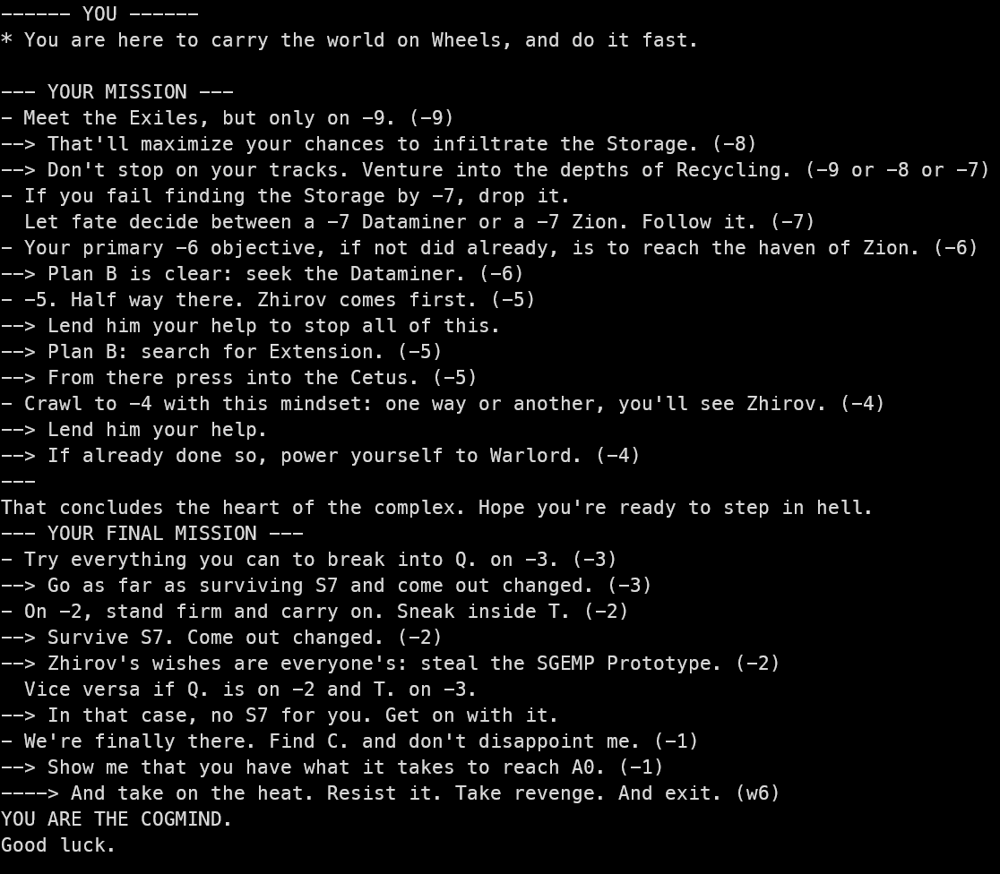

# Cogmind Build/Route randomizer

This small python script chooses a build archetype and a route for you at random and prints it as a mission order.
- Randomizes your propulsion type.
- Randomizes your alignment and/or some build-defining items and/or some special modes.
- Randomizes your route, taking into account branches, alignment, exclusions.

## Example route

## How to use
- [Install python3](https://www.python.org/downloads/)
- Click on Code -> Download zip, extract it in its own folder
- Open a terminal in the folder. If you don't know how to on Windows, double click open_a_terminal_here.bat.
- In the terminal, type `python3 cogmind_build_randomizer.py` and press enter

Supports up to Beta 13. Let me know if a build archetype or route would
seem relevant to add.

## A bit more complex build/route

