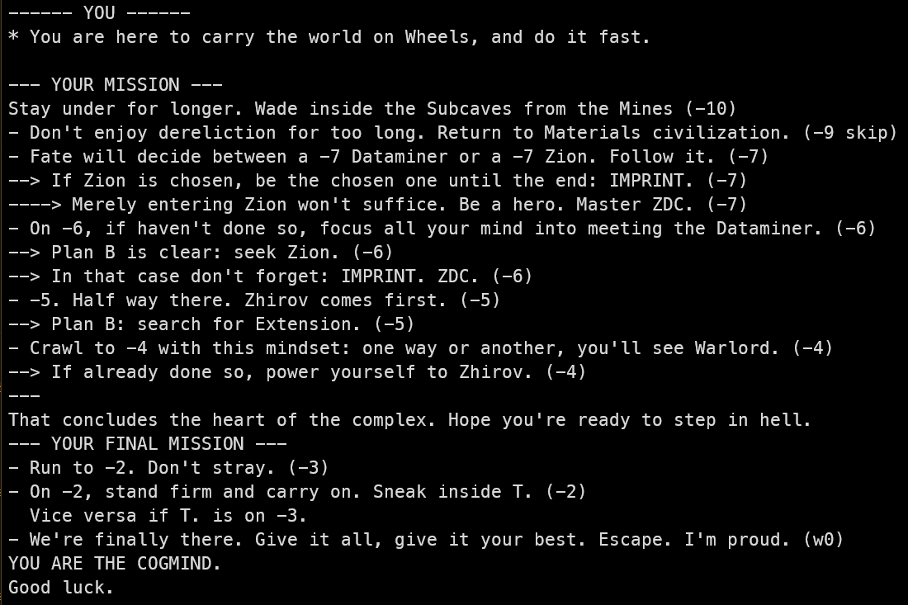

# Cogmind Build/Route randomizer

This small python script chooses a build archetype and a route for you at random and prints it as a mission order.
- Randomizes your propulsion type.
- Randomizes your alignment and/or some build-defining items and/or some special modes.
- Randomizes your route, taking into account branches, alignment, exclusions.

## How to use
- [Install python3](https://www.python.org/downloads/)
- Click on Code -> Download zip, extract it in its own folder
- Open a terminal in the folder. If you don't know how to on Windows, double click open_a_terminal_here.bat.
- In the terminal, type `python3 cogmind_build_randomizer.py` and press enter

Script is modular enough you can opt to only print a subset of your mission. For example if you don't want it to choose a propulsion type:
- open cogmind_build_randomizer.py in a text editor
- jump to end of the file and add a hashtag at the start of the line print_propulsion_build() to comment it out. The same way you can disable printing the early game route, mid game, end game, etc.

Supports up to Beta 13. Keep in mind I'm still unspoiled about many parts of
the game, especially endgame so let me know if a build archetype or route would
seem relevant to add.

